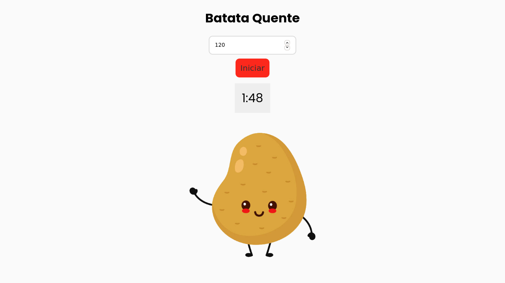

# Batata Quente

Temporizador estilo batata quente feito totalmente com HTML, CSS e JS

# Uso

Clique no input de tempo, insira quantos segundos e clique no botão para começar.

# Contribuindo

Caso você queria contribuir com o projeto, crie o seu fork, a sua branch, faça as alterações e crie sua pull request.
